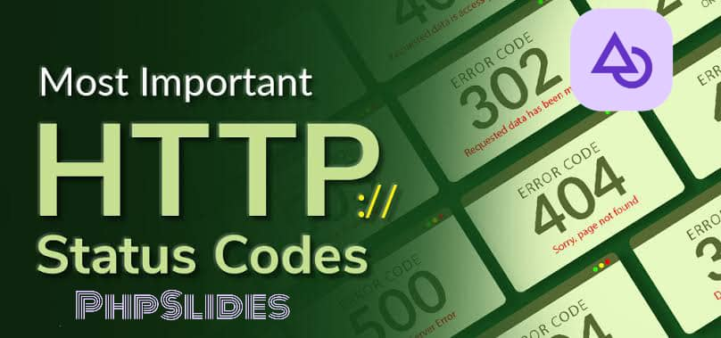

# HTTP PhpSlides\Status

<div align="center">
   
</div>

## INSTALLATION

After creating your PhpSlides project, navigate to the project directory and install PhpSlides-Status package using this command below:

```bash
composer require phpslides/status
```

Or download the zip file directly from the released version, ectract the file and add it to a folder 📂 in your PhpSlides project.

[Download phpslides\status zip](https://github.com/phpslides/status/releases/tag/v0.0.3)

## QUICK START

### Using Status() class function

Create a Status instance for API response. Which is used in PhpSlides API Controller Class

```php
$status = new Status();
```

```php
<?php

namespace App\Controller\Api;

use PhpSlides\Status;
use PhpSlides\Http\Request;
use PhpSlides\Http\ApiController;

final class UserController extends ApiController
{
   public function index(Request $req) {
      $status = new Status();
   }
}

?>
```

You can pass a string value to the `Status()` function parameter which is by default `ResponseType::JSON` using the Response namespace `PhpSlides\Enums\ResponseType`

In returning value in JSON format. The parameter includes this enum value type:

```php
use PhpSlides\Enums\ResponseType;

ResponseType::JSON;
ResponseType::HTML;
ResponseType::CSV;
ResponseType::XML;

new Status(ResponseType::JSON);
```

If the parameters contain any value apart from the `enum ResponseType value`
it'll return default value an array form, which isn't recommended.

### Some Functions & Methods

#### success() method

Returning a default success message, using the `success()` method.

```php
$status = new Status(Response::JSON);
$status->success();
```

```php
<?php

namespace App\Controller\Api;

use PhpSlides\Status;
use PhpSlides\Enums\ResponseType;
use PhpSlides\Http\Request;
use PhpSlides\Http\ApiController;

final class UserController extends ApiController {
   public function index() {
      $status = new Status(Response::JSON);
      return $status->success();
   }
}

?>
```

The `success()` method takes 2 parameters, `$data` to render and `$status` which is the status code.

The first parameter can be either Array or String and the second parameter is an Integer from `StatusCode` static class.
It returns `ResponseType::<type>` which is passed as a parameter in the `Status()` function.

```php
use PhpSlides\StatusCode;

$user = [
    "name": "John Doe",
    "email": "john@doe.com"
];
return (new Status())->success($user, StatusCode::OK);
```

#### error() method

Returning an error Api message using the `error()` method
It also takes 2 parameters, the first is either an Array or String and the second which is interger for setting `http_response_code`,
it has default value of `StatusCode::INTERNAL_SERVER_ERROR` which is `500`

It also returns `ResponseType::<type>`

```php

return (new Status(ResponseType::JSON))->error('User not Found', StatusCode::NOT_FOUND);
```

#### Full code for success() & error() methods

If no parameter is specified in the `Status()`,
by default it's returning `ResponseType::JSON` for returning response in JSON format

```php
<?php

namespace App\Controller\Api;

use PhpSlides\Http\ApiController;
use PhpSlides\Http\ResponseType;
use PhpSlides\Http\Request;
use PhpSlides\StatusCode;
use PhpSlides\Status;

final class UserController extends ApiController
{
   public function index(Request $req) {
      $status = new Status();
      $user_id = $req->urlParam()->user_id;

      if ($user_id === 1) {
         $user = [
             'name': 'John Doe',
             'email': 'john@doe.com',
             'user_id': $user_id
         ];

         $response = $status->success($user); // by default the second parameter is `StatusCode::OK`
      } else {
         // not found message
         $response = $status->error("User user_id=$user_id is not found", StatusCode::NOT_FOUND);
      }

      return $response; // return message as a JSON format `Response::JSON`
   }
}

?>
```

## Namespace and Status Interface

### namespace

`\PhpSlides\Status()`

`\PhpSlides\StatusCode`

`\PhpSlides\StatusText`

`\PhpSlides\Http\Response`

`\PhpSlides\Enums\ResponseType`

`\PhpSlides\Interface\StatusInterface`

`\PhpSlides\Interface\ResponseInterface`

`\PhpSlides\Status\Exception\ApiException()`

`\PhpSlides\Status\Exception\ExceptionInterface`

### Status() Interface Methods

`__construct(string $response = ResponseType::JSON)`

`public function getStatus (): int;`

`public function getStatusText (): string;`

`public function getMessage (): mixed;`

`public function get (): string|array;`

`public function getJson (): string;`

`public function set (mixed $data, int $status = StatusCode::NO_CONTENT, string $statusText = StatusText::NO_CONTENT ): void;`

`public function setStatus (int $status): void;`

`public function setStatusText (string $statusText): void;`

`public function setMessage (mixed $message): void;`

`public function error (array|string $data, int $status = StatusCode::INTERNAL_SERVER_ERROR): string|array;`

`public function success (array|string $data, int $status = StatusCode::OK): string|array;`

### Response{} Interface Method

`public static function json(array $data = [], int $status = StatusCode::OK): string;`

`public static function html(array $data = [], int $status = StatusCode::OK): string;`

`public static function csv(array $data = [], int $status = StatusCode::OK): string;`

`public static function xml(array $data = [], int $status = StatusCode::OK): string;`

`public static function array(array $data = [], int $status = StatusCode::UNSUPPORTED_MEDIA_TYPE): array;`

### enum ResponseType{} Interface

`const JSON = 'JSON';`

`const HTML = 'HTML';`

`const CSV = 'CSV';`

`const XML = 'XML';`

## DOCUMENTATION

### Status Class Methods

The `Status` class provides several methods to manage and format API responses in different formats such as JSON, HTML, CSV, or XML. Here's a quick guide on how to use them.

#### `__construct(string $response = ResponseType::JSON)`

The constructor initializes a new `Status` instance. You can specify the response format by passing a `ResponseType` enum value. If no value is passed, it defaults to `ResponseType::JSON`.

```php
$status = new Status(); // Defaults to JSON
$status = new Status(ResponseType::HTML); // Initializes with HTML response type
```

#### `getStatus(): int`

This method retrieves the current HTTP status code.

```php
$httpStatus = $status->getStatus(); // Returns the current HTTP status code
```

#### `getStatusText(): string`

Retrieves the status text corresponding to the HTTP status code.

```php
$statusText = $status->getStatusText(); // Returns status text, e.g., "OK" for 200
```

#### `getMessage(): mixed`

Gets the message set for the response. This could be an array, string, or any data type depending on the response.

```php
$message = $status->getMessage(); // Returns the message set in the response
```

#### `get(): string|array`

Retrieves the response data in its raw form, either as a string or an array.

```php
$response = $status->get(); // Returns the raw response data
```

#### `getJson(): string`

Converts the response data to a JSON string. This method is useful when you need to explicitly get the response in JSON format.

```php
$jsonResponse = $status->getJson(); // Returns the response as a JSON string
```

#### `set(mixed $data, int $status = StatusCode::NO_CONTENT, string $statusText = StatusText::NO_CONTENT): void`

Sets the response data, status code, and status text. This method is used to manually define the response properties.

```php
$status->set(['key' => 'value'], StatusCode::OK, StatusText::OK); // Sets custom response data
```

#### `setStatus(int $status): void`

Sets the HTTP status code.

```php
$status->setStatus(StatusCode::OK); // Manually set the status code
```

#### `setStatusText(string $statusText): void`

Sets the status text corresponding to the HTTP status code.

```php
$status->setStatusText(StatusText::OK); // Manually set the status text
```

#### `setMessage(mixed $message): void`

Sets the message for the response. This message can be an array, string, or any other data type.

```php
$status->setMessage('Success message'); // Manually set the response message
```

#### `error(array|string $data, int $status = StatusCode::INTERNAL_SERVER_ERROR): string|array`

Creates an error response. You can pass the error message and an optional status code. By default, it sets the status code to 500 (Internal Server Error).

```php
$errorResponse = $status->error('An error occurred', StatusCode::BAD_REQUEST); // Returns error response in JSON
```

#### `success(array|string $data, int $status = StatusCode::OK): string|array`

Creates a success response. You can pass the response data and an optional status code. By default, it sets the status code to 200 (OK).

```php
$successResponse = $status->success(['message' => 'Operation successful']); // Returns success response in JSON
```

### Response Class Methods

The `Response` class provides static methods to directly return responses in different formats. These methods are especially useful when you want to quickly output data without creating a `Status` instance.

#### `json(array $data = [], int $status = StatusCode::OK): string`

Returns the data in JSON format with the specified HTTP status code.

```php
$response = Response::json(['key' => 'value'], StatusCode::CREATED); // Outputs JSON response
```

#### `html(array $data = [], int $status = StatusCode::OK): string`

Returns the data formatted as HTML.

```php
$response = Response::html(['key' => 'value'], StatusCode::OK); // Outputs HTML response
```

#### `csv(array $data = [], int $status = StatusCode::OK): string`

Returns the data formatted as CSV.

```php
$response = Response::csv(['key' => 'value'], StatusCode::OK); // Outputs CSV response
```

#### `xml(array $data = [], int $status = StatusCode::OK): string`

Returns the data formatted as XML.

```php
$response = Response::xml(['key' => 'value'], StatusCode::OK); // Outputs XML response
```

#### `array(array $data = [], int $status = StatusCode::UNSUPPORTED_MEDIA_TYPE): array`

Returns the data as a PHP array. This is a fallback option if none of the other formats is specified.

```php
$response = Response::array(['key' => 'value']); // Outputs data as an array
```

### enum ResponseType

The `ResponseType` enum provides predefined constants for the supported response formats. These include:

-  `ResponseType::JSON` - For JSON format
-  `ResponseType::HTML` - For HTML format
-  `ResponseType::CSV` - For CSV format
-  `ResponseType::XML` - For XML format

Use these constants when specifying the response type in the `Status` class.

```php
$status = new Status(ResponseType::XML); // Initializes the Status class with XML response type
```
